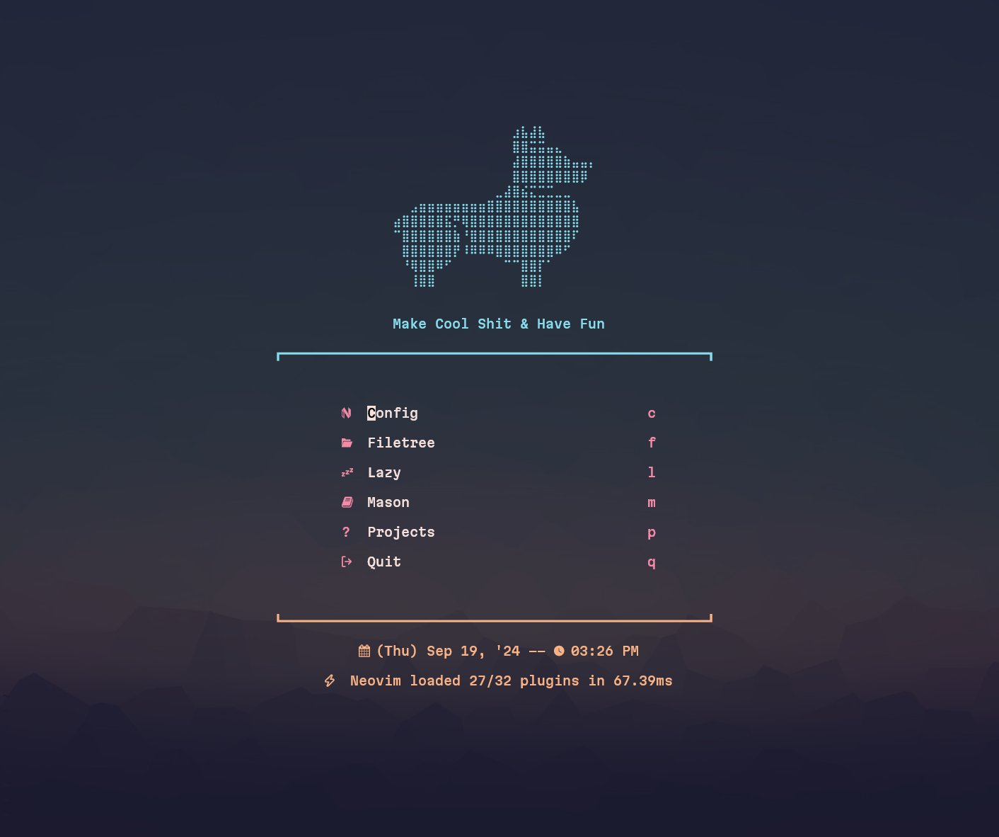

# DaltVim



## Plugins Installed

| Plugin | Description | Config File |
| - | - | - |
| [Catppuccin](https://github.com/catppuccin/nvim) | Pastel color theme with integrations for many plugins | `plugins/colors.lua` |
| [Conform](https://github.com/stevearc/conform.nvim) | Automatic formatting on save, with per-language formatter configuration | `plugins/formatting.lua` |
| [Dashboard](https://github.com/nvimdev/dashboard-nvim) | Startup screen with shortcuts to common actions | `plugins/dashboard.lua` |
| [Floating Help](https://github.com/nil70n/floating-help) | Opens `:help` windows as floating popups instead of splits | `plugins/float-help.lua` |
| [Mason](https://github.com/mason-org/mason.nvim) | Package manager for LSP servers, formatters, linters, and DAP servers | `plugins/lsp.lua` |
| [Mason-LSPConfig](https://github.com/mason-org/mason-lspconfig.nvim) | Bridges Mason and nvim-lspconfig for automatic LSP server setup | `plugins/lsp.lua` |
| [Neo-tree](https://github.com/nvim-neo-tree/neo-tree.nvim) | Tree-based browser for files, git status, and document symbols | `plugins/neotree.lua` |
| [Noice](https://github.com/folke/noice.nvim) | Replaces the command line, messages, and popupmenu with modern UI | `plugins/noice.lua` |
| [nvim-cmp](https://github.com/hrsh7th/nvim-cmp) | Auto-completion engine with LSP integration | `plugins/lsp.lua` |
| [nvim-ts-autotag](https://github.com/windwp/nvim-ts-autotag) | Automatically close and rename paired HTML/JSX tags | `plugins/formatting.lua` |
| [Render Markdown](https://github.com/MeanderingProgrammer/render-markdown.nvim) | Pretty inline rendering of markdown with headers, lists, and code blocks | `plugins/languages.lua` |
| [Telescope](https://github.com/nvim-telescope/telescope.nvim) | Fuzzy finder for files, buffers, registers, spell suggestions, and more | `plugins/telescope.lua` |
| [ToggleTerm](https://github.com/akinsho/toggleterm.nvim) | Floating terminal and lazygit integration | `plugins/toggleterm.lua` |
| [Treesitter](https://github.com/nvim-treesitter/nvim-treesitter) | Incremental parsing for syntax highlighting, indentation, and text objects | `plugins/treesitter.lua` |
| [Trouble](https://github.com/folke/trouble.nvim) | Pretty list viewer for diagnostics, quickfix, and location lists | `plugins/trouble.lua` |
| [Undotree](https://github.com/jiaoshijie/undotree) | Visual tree-based undo history for branching edits | `plugins/undotree.lua` |
| [Vim Sleuth](https://github.com/tpope/vim-sleuth) | Auto-detects tabstop, shiftwidth, and expandtab from file contents | `plugins/editor.lua` |
| [Which Key](https://github.com/folke/which-key.nvim) | Shows available keybindings as you type leader/chord sequences | `plugins/whichkey.lua` |

### Mini

[mini.nvim](https://github.com/echasnovski/mini.nvim) is a collection of small, standalone plugins. Config file: `plugins/mini.lua`

| Module | Description |
| - | - |
| `mini.hipatterns` | Highlight patterns like TODO keywords and inline hex colors |
| `mini.icons` | Glyph and icon provider used by other plugins (Neo-tree, etc.) |
| `mini.jump` | Enhanced `f`/`t` motions with repeat via `;` |
| `mini.jump2d` | Jump to any visible location on screen (default keymap: `<CR>`) |
| `mini.move` | Move lines or selections directionally without cut/paste (`<C-M-hjkl>`) |
| `mini.pairs` | Auto-pairing for brackets, quotes, and parentheses |
| `mini.statusline` | Lightweight statusline |
| `mini.surround` | Add, delete, or replace surrounding pairs (e.g. `sa`, `sd`, `sr`) |

## Keymaps

### General

| Keymap | Mode | Description |
| - | - | - |
| `<Space>` | n | Leader key |
| `<Esc>` | n | Clear search highlight |
| `<C-s>` | i, x, n, s | Save file |
| `<C-h/j/k/l>` | n | Move focus between split windows |
| `n` / `N` | n, x, o | Next/previous search result (centered) |

### Terminal

| Keymap | Mode | Description |
| - | - | - |
| `<Esc><Esc>` | t | Toggle terminal window |
| `<Esc>` | t | Exit terminal mode (return to normal mode) |
| `<leader>ft` | n | Open floating terminal |
| `<leader>fg` | n | Open floating lazygit |

### LSP (active when a language server is attached)

Neovim 0.11+ provides these natively:

| Keymap | Description |
| - | - |
| `K` | Hover documentation |
| `grn` | Rename symbol |
| `grr` | Find references |
| `gra` | Code action |
| `gri` | Go to implementation |
| `gO` | Document symbols |

Custom LSP keymaps (set in `config/after.lua`):

| Keymap | Description |
| - | - |
| `gd` | Go to definition |
| `gD` | Go to declaration |
| `go` | Go to type definition |
| `gs` | Signature help |
| `<F2>` | Rename |
| `<F3>` | Format (async) |
| `<F4>` | Code action |

### Completion (nvim-cmp)

| Keymap | Description |
| - | - |
| `<C-n>` | Next completion item |
| `<C-p>` | Previous completion item |
| `<C-y>` | Confirm selection |
| `<C-Space>` | Trigger completion |
| `<C-e>` | Abort completion |
| `<C-u>` / `<C-d>` | Scroll documentation up/down |

### Leader Key Groups

| Prefix | Group | Key Bindings |
| - | - | - |
| `<leader>f` | Find | `ff` files, `fb` buffer, `fr` registers, `fs` spell, `ft` terminal, `fg` git |
| `<leader>n` | Neo-tree | `nc` close, `nf` files, `ng` git status, `ns` symbols |
| `<leader>s` | Search | (Telescope search group) |
| `<leader>x` | Trouble | `xx` diagnostics, `xl` location list, `xq` quickfix |
| `<leader>u` | | Undotree toggle |
| `<leader>uce` | | Clear Windows line endings |
| `<leader>d` | | Dashboard |
| `<leader>?` | | Local buffer keymaps (Which Key) |

### Treesitter

| Keymap | Mode | Description |
| - | - | - |
| `<C-Space>` | n | Start/increment selection |
| `<BS>` | x | Decrement selection |
| `]f` / `[f` | n | Next/previous function start |
| `]F` / `[F` | n | Next/previous function end |
| `]c` / `[c` | n | Next/previous class start |
| `]C` / `[C` | n | Next/previous class end |
| `]a` / `[a` | n | Next/previous parameter |

## Config Structure

```
~/.config/nvim/
├── init.lua                     # Entry point: leader keys, load order
├── lsp/
│   └── gdscript.lua             # GDScript LSP server config
├── lua/
│   ├── config/
│   │   ├── options.lua          # Neovim options (numbers, clipboard, etc.)
│   │   ├── keymaps.lua          # Core keymaps and yank highlight autocmd
│   │   ├── lazy.lua             # Lazy.nvim bootstrap and plugin loader
│   │   ├── after.lua            # Post-plugin setup (LSP keymaps, CMP, Godot, etc.)
│   │   └── whichkey-groups.lua  # Which-key leader group registrations
│   └── plugins/
│       ├── colors.lua           # Catppuccin theme
│       ├── dashboard.lua        # Startup dashboard screen
│       ├── editor.lua           # Vim Sleuth (auto-detect indentation)
│       ├── float-help.lua       # Floating help windows
│       ├── formatting.lua       # Conform formatter + ts-autotag
│       ├── languages.lua        # Render Markdown
│       ├── lsp.lua              # Mason, Mason-LSPConfig, nvim-cmp
│       ├── mini.lua             # mini.nvim modules
│       ├── neotree.lua          # Neo-tree file browser
│       ├── noice.lua            # Noice UI + nvim-notify
│       ├── telescope.lua        # Telescope fuzzy finder
│       ├── toggleterm.lua       # ToggleTerm floating terminal
│       ├── treesitter.lua       # Treesitter syntax parsing
│       ├── trouble.lua          # Trouble diagnostics viewer
│       ├── undotree.lua         # Undo history tree
│       └── whichkey.lua         # Which Key keymap viewer
└── lazy-lock.json               # Plugin version lock file
```

## Problems I've Discovered

### Pending

- Open link under cursor in browser
    - I tried `url-open` but it was unable to launch URLs inside of WSL properly for me

### Solved

- Way to jump into config from Dashboard
    - Using `Telescope` and pointing it to nvim config folder
- A way to interact with files and folders that isn't netrw
    - `Neotree` for full-dir visualizing, and adding/renaming/moving/etc
    - `Telescope` for moving quickly between files and searching for them (among other things)
- No autocompleting braces/parens
    - `mini.pairs`
- How can I wrap existing text with parents/quotes/etc? (ie "string" -> { "string" } )
    - `mini.surround`
- Jumping to stuff in view
    - `mini.jump2d` (jump to any visible location, default `<CR>`)

## Things To Do

### General Considerations

- Consider replacing Neotree with mini.files + fugitive, it looks like it's a bit cleaner for what I want

### Configuration of Installed Plugins

- Configure `mini.statusline` sections if needed

### Concepts To Investigate Without Installed Plugins

- [ ] Testing
- [ ] Folding
- [ ] Debugging
- [ ] AI...?
