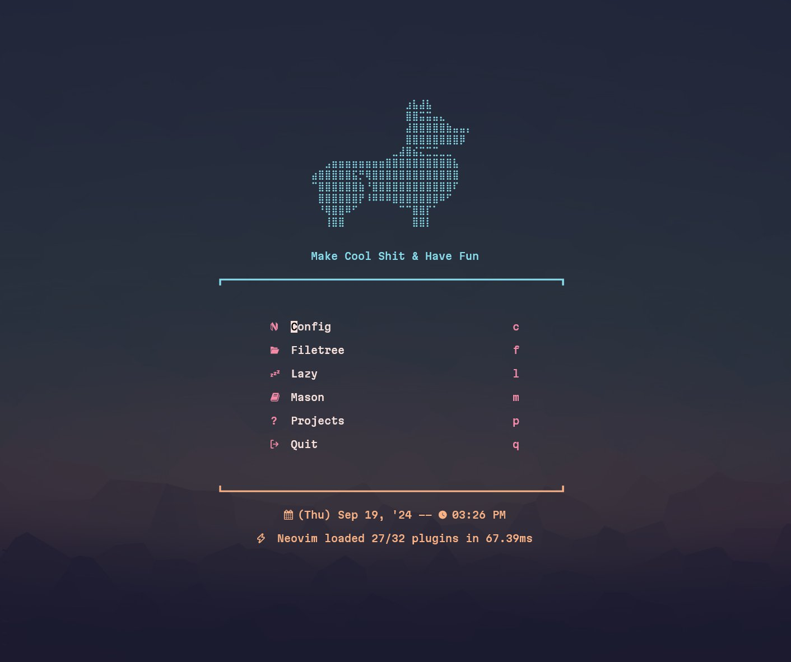

# DaltVim



## Plugins Installed

| Plugin | Description | Config File |
| - | - | - |
| [Catppuccin](https://github.com/catppuccin/nvim) | Pastel color theme with integrations for many plugins | `plugins/ui.lua` |
| [Conform](https://github.com/stevearc/conform.nvim) | Automatic formatting on save, with per-language formatter configuration | `plugins/editor.lua` |
| [Floating Help](https://github.com/nil70n/floating-help) | Opens `:help` windows as floating popups instead of splits | `plugins/ui.lua` |
| [LazyDev](https://github.com/folke/lazydev.nvim) | Feeds `lua_ls` Neovim runtime types and types for plugins referenced in this config | `plugins/lsp.lua` |
| [Mason](https://github.com/mason-org/mason.nvim) | Package manager for LSP servers, formatters, linters, and DAP servers | `plugins/lsp.lua` |
| [Mason-LSPConfig](https://github.com/mason-org/mason-lspconfig.nvim) | Bridges Mason and nvim-lspconfig for automatic LSP server setup | `plugins/lsp.lua` |
| [Noice](https://github.com/folke/noice.nvim) | Replaces the command line, messages, and popupmenu with modern UI | `plugins/ui.lua` |
| [nvim-cmp](https://github.com/hrsh7th/nvim-cmp) | Auto-completion engine with LSP integration | `plugins/lsp.lua` |
| [nvim-highlight-colors](https://github.com/brenoprata10/nvim-highlight-colors) | Renders hex/HSL/CSS color values inline | `plugins/ui.lua` |
| [nvim-ts-autotag](https://github.com/windwp/nvim-ts-autotag) | Automatically close and rename paired HTML/JSX tags | `plugins/editor.lua` |
| [Render Markdown](https://github.com/MeanderingProgrammer/render-markdown.nvim) | Pretty inline rendering of markdown with headers, lists, and code blocks | `plugins/editor.lua` |
| [Snacks](https://github.com/folke/snacks.nvim) | Dashboard, file picker/explorer, git pickers, terminal, image viewer, and more | `plugins/mini_snacks.lua` |
| [Todo Comments](https://github.com/folke/todo-comments.nvim) | Highlight TODO-style keywords in comments (searched via Snacks picker) | `plugins/navigation.lua` |
| [Treesitter](https://github.com/nvim-treesitter/nvim-treesitter) | Incremental parsing for syntax highlighting, indentation, and text objects | `plugins/treesitter.lua` |
| [Treesitter Textobjects](https://github.com/nvim-treesitter/nvim-treesitter-textobjects) | Function/class/parameter motions on top of Treesitter | `plugins/treesitter.lua` |
| [Vim Sleuth](https://github.com/tpope/vim-sleuth) | Auto-detects tabstop, shiftwidth, and expandtab from file contents | `plugins/editor.lua` |
| [Which Key](https://github.com/folke/which-key.nvim) | Shows available keybindings as you type leader/chord sequences | `plugins/editor.lua` |

Neo-tree, Telescope, Undotree, and ToggleTerm have been replaced by [Snacks](https://github.com/folke/snacks.nvim)'s picker, explorer, and terminal modules (see `plugins/mini_snacks.lua`).

### Mini

[mini.nvim](https://github.com/nvim-mini/mini.nvim) is a collection of small, standalone plugins. Config file: `plugins/mini_snacks.lua`

| Module | Description |
| - | - |
| `mini.icons` | Glyph and icon provider used by other plugins (also shimmed in as `nvim-web-devicons` for plugins that expect it) |
| `mini.indentscope` | Visual indent scope indicator |
| `mini.jump` | Enhanced `f`/`t` motions with repeat via `;` |
| `mini.jump2d` | Jump to any visible location on screen (default keymap: `<CR>`) |
| `mini.move` | Move lines or selections directionally without cut/paste (`<C-M-hjkl>`) |
| `mini.pairs` | Auto-pairing for brackets, quotes, and parentheses |
| `mini.statusline` | Lightweight statusline |
| `mini.surround` | Add, delete, or replace surrounding pairs (e.g. `sa`, `sd`, `sr`) |

## Keymaps

### General

| Keymap | Mode | Description |
| - | - | - |
| `<Space>` | n | Leader key |
| `<Esc>` | n | Clear search highlight |
| `<C-s>` | i, x, n, s | Save file |
| `<C-h/j/k/l>` | n | Move focus between split windows |
| `n` / `N` | n, x, o | Next/previous search result (centered) |

### Terminal

| Keymap | Mode | Description |
| - | - | - |
| `<C-/>` / `<C-_>` | n | Toggle floating terminal (Snacks) |
| `<C-/>` / `<C-_>` | t | Hide terminal |
| `<Esc>` | t | Exit terminal mode (return to normal mode) |

### LSP (active when a language server is attached)

Neovim 0.11+ provides these natively:

| Keymap | Description |
| - | - |
| `K` | Hover documentation |
| `grn` | Rename symbol |
| `grr` | Find references (overridden below by picker-backed `gr`) |
| `gra` | Code action |
| `gri` | Go to implementation (overridden below by picker-backed `gI`) |
| `gO` | Document symbols |

Custom LSP keymaps (set in `plugins/lsp.lua`), backed by `Snacks.picker`:

| Keymap | Description |
| - | - |
| `gd` | Go to definition |
| `gD` | Go to declaration |
| `gr` | Find references |
| `gI` | Go to implementation |
| `gy` | Go to type definition |
| `gs` | Signature help |
| `<F2>` | Rename |
| `<F3>` | Format (async) |

### Completion (nvim-cmp)

| Keymap | Description |
| - | - |
| `<C-n>` | Next completion item |
| `<C-p>` | Previous completion item |
| `<C-y>` | Confirm selection |
| `<C-Space>` | Trigger completion |
| `<C-e>` | Abort completion |
| `<C-u>` / `<C-d>` | Scroll documentation up/down |

### Snacks (find, git, search, explorer)

| Keymap | Description |
| - | - |
| `<leader><space>` | Smart find files |
| `<leader>,` | Buffers |
| `<leader>/` | Grep |
| `<leader>e` | File explorer |
| `<C-n>` | Toggle file explorer (open/close) |
| `<leader>fc` | Find config file |
| `<leader>ff` | Find files |
| `<leader>fg` | Find git files |
| `<leader>fr` | Recent files |
| `<leader>gb` | Git branches |
| `<leader>gl` | Git log |
| `<leader>gs` | Git status |
| `<leader>gS` | Git stash |
| `<leader>gd` | Git diff (hunks) |
| `<leader>gg` | Lazygit |
| `<leader>gi` | GitHub issues (open) |
| `<leader>gI` | GitHub issues (all) |
| `<leader>gp` | GitHub pull requests (open) |
| `<leader>gP` | GitHub pull requests (all) |
| `<leader>sd` | Diagnostics |
| `<leader>sD` | Buffer diagnostics |
| `<leader>sh` | Help pages |
| `<leader>sk` | Keymaps |
| `<leader>ss` | LSP symbols |
| `<leader>sS` | LSP workspace symbols |
| `<leader>su` | Undo history |
| `<leader>sw` | Grep visual selection or word under cursor |
| `<leader>st` | Find TODOs |

### Leader Key Groups

| Prefix | Group |
| - | - |
| `<leader>f` | Find |
| `<leader>g` | Git |
| `<leader>s` | Search |
| `<leader>?` | Local buffer keymaps (Which Key) |

### Treesitter

| Keymap | Mode | Description |
| - | - | - |
| `]f` / `[f` | n, x, o | Next/previous function start |
| `]F` / `[F` | n, x, o | Next/previous function end |
| `]c` / `[c` | n, x, o | Next/previous class start |
| `]C` / `[C` | n, x, o | Next/previous class end |
| `]a` / `[a` | n, x, o | Next/previous parameter start |
| `]A` / `[A` | n, x, o | Next/previous parameter end |

## Config Structure

```
~/.config/nvim/
├── init.lua                     # Entry point: leader keys, load order, colorscheme
├── lsp/
│   └── gdscript.lua             # GDScript LSP server config (Neovim 0.11 native)
├── lua/
│   ├── config/
│   │   ├── options.lua          # Neovim options (numbers, clipboard, etc.)
│   │   ├── keymaps.lua          # Core keymaps and yank highlight autocmd
│   │   ├── lazynvim.lua         # Lazy.nvim bootstrap and plugin loader
│   │   └── godot.lua            # Godot LSP enable and pipe server setup
│   └── plugins/
│       ├── editor.lua           # Vim Sleuth, Conform, ts-autotag, Render Markdown, Which Key
│       ├── lsp.lua              # Mason, Mason-LSPConfig, LazyDev, nvim-cmp, LSP keymaps
│       ├── mini_snacks.lua      # mini.nvim modules + Snacks (dashboard, picker, explorer, terminal, image)
│       ├── navigation.lua       # Todo Comments (TODO-style keyword highlighting)
│       ├── treesitter.lua       # Treesitter syntax parsing + textobjects + VHS/Go template support
│       └── ui.lua               # Catppuccin theme, Noice, nvim-notify, nvim-highlight-colors, Floating Help
├── notes/
│   └── plugin-template.lua      # Template for new plugin specs
└── lazy-lock.json               # Plugin version lock file
```

## Problems I've Discovered

### Pending

- Open link under cursor in browser
    - I tried `url-open` but it was unable to launch URLs inside of WSL properly for me

### Solved

- Way to jump into config from Dashboard
    - Snacks dashboard shortcut opens a file picker rooted at the config dir
- A way to interact with files and folders that isn't netrw
    - Snacks explorer for full-dir visualizing, and adding/renaming/moving/etc
    - Snacks picker for moving quickly between files and searching for them (among other things)
- No autocompleting braces/parens
    - `mini.pairs`
- How can I wrap existing text with parents/quotes/etc? (ie "string" -> { "string" } )
    - `mini.surround`
- Jumping to stuff in view
    - `mini.jump2d` (jump to any visible location, default `<CR>`)

## Things To Do

### General Considerations

(none currently)

### Configuration of Installed Plugins

- Configure `mini.statusline` sections if needed

### Concepts To Investigate Without Installed Plugins

- [ ] Testing
- [ ] Folding
- [ ] Debugging
- [ ] AI...?
</content>
